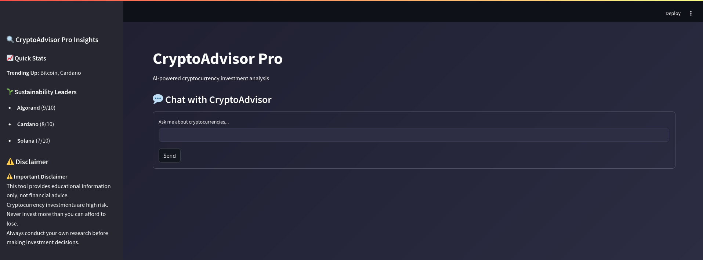
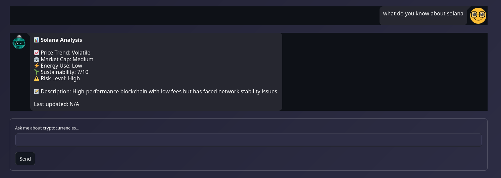

# CryptoAdvisor Chatbot - README


## 🌟 Project Overview

CryptoAdvisor is an intelligent chatbot that provides cryptocurrency investment advice based on profitability metrics (price trends, market cap) and sustainability factors (energy efficiency, project viability). The application features a modern web interface with interactive chat capabilities.

## 🏗️ Project Structure

```
crypto-advisor/
├── app.py                # Main application entry point
├── config/
│   ├── __init__.py
│   ├── settings.py       # Configuration constants
│   └── styles.py         # CSS and UI styling
├── data/
│   ├── __init__.py
│   └── crypto_db.py      # Cryptocurrency dataset
├── utils/
│   ├── __init__.py
│   └── helpers.py        # Helper functions
├── screenshots/          # Application screenshots
│   ├── chat-interface.png
│   ├── recommendation.png
│   └── sustainability.png
├── requirements.txt      # Dependencies
└── README.md             # This file
```

## 📁 File Descriptions

### 1. `app.py`
The main application file containing:
- Streamlit UI configuration
- Chat interface logic
- Response generation system
- Session state management

**Key Components:**
```python
def get_response(user_input: str) -> str:
    """Processes user input and generates appropriate responses"""
    # Intent detection and response routing logic

def display_chat_interface():
    """Renders the chat UI with message history"""
    # Uses streamlit-chat for beautiful message bubbles

def display_sidebar():
    """Shows quick insights and disclaimers"""
    # Contains trending coins and sustainability leaders
```

### 2. `config/settings.py`
Application constants and configurations:
```python
APP_NAME = "CryptoAdvisor Pro"
DISCLAIMER = "⚠️ Investment disclaimer text..."
```

### 3. `config/styles.py`
Custom CSS styles for the UI:
```python
MAIN_STYLE = """
<style>
    .stApp {
        background: linear-gradient(135deg, #1e1e2f 0%, #2d2d44 100%);
    }
    /* More stylish components */
</style>
"""
```

### 4. `data/crypto_db.py`
Cryptocurrency dataset with metrics:
```python
CRYPTO_DB = {
    "Bitcoin": {
        "price_trend": "rising",
        "sustainability_score": 3,
        # ... other metrics
    },
    # Other cryptocurrencies
}
```

### 5. `utils/helpers.py`
Analytical functions:
```python
def analyze_profitability(coin_data: Dict) -> float:
    """Calculates 0-10 score based on market factors"""

def generate_recommendation() -> Tuple[str, Dict]:
    """Recommends coins based on weighted scores"""
```

## 🚀 How to Run the Project

### Prerequisites
- Python 3.7+
- pip package manager

### Installation

1. **Clone the repository**
   ```bash
   git clone https://github.com/yourusername/crypto-advisor.git
   cd crypto-advisor
   ```

2. **Create and activate virtual environment**
   ```bash
   python -m venv venv
   source venv/bin/activate  # Linux/Mac
   venv\Scripts\activate    # Windows
   ```

3. **Install dependencies**
   ```bash
   pip install -r requirements.txt
   ```

4. **Run the application**
   ```bash
   streamlit run app.py
   ```

5. **Access the app** in your browser at `http://localhost:8501`

## 🖼️ Application Screenshots

### Chat Interface

*The main chat window showing conversation flow*

### Recommendation Engine

*Investment recommendation with detailed analysis*

### Comparisons

*Top sustainable cryptocurrencies comparison*

## 🧠 Code Complexity & Design

### Architectural Highlights
1. **Modular Design** - Separation of concerns between UI, data, and business logic
2. **Type Hints** - Comprehensive type annotations for better maintainability
3. **Session Management** - Preserves chat history during interaction
4. **Weighted Scoring** - Balances profitability and sustainability factors

### Key Algorithms
```python
# Weighted recommendation algorithm example
total_score = (profit_score * 0.6) + (sustain_score * 0.4)
```

### Performance Considerations
- Lightweight in-memory data storage
- Efficient response generation with O(n) complexity for coin analysis
- Streamlit's reactive programming model for smooth UI updates

## 🤝 Contributing
1. Fork the repository
2. Create your feature branch (`git checkout -b feature/AmazingFeature`)
3. Commit your changes (`git commit -m 'Add some amazing feature'`)
4. Push to the branch (`git push origin feature/AmazingFeature`)
5. Open a Pull Request

## 📜 License
Distributed under the MIT License. See `LICENSE` for more information.

## ✉️ Contact
Project Maintainer - [StephenLegacy](mailto:oloostephen20191@gmail.com)

---

💡 **Tip**: For the best experience, run the app in a browser window at least 1200px wide to see the sidebar content properly!